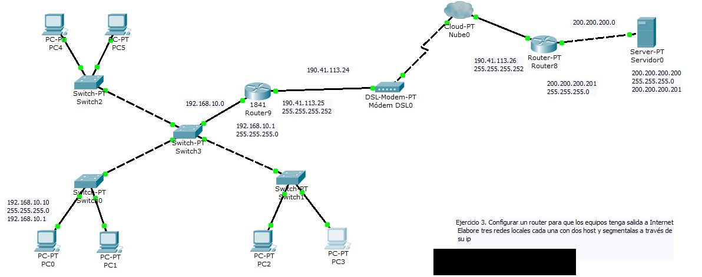
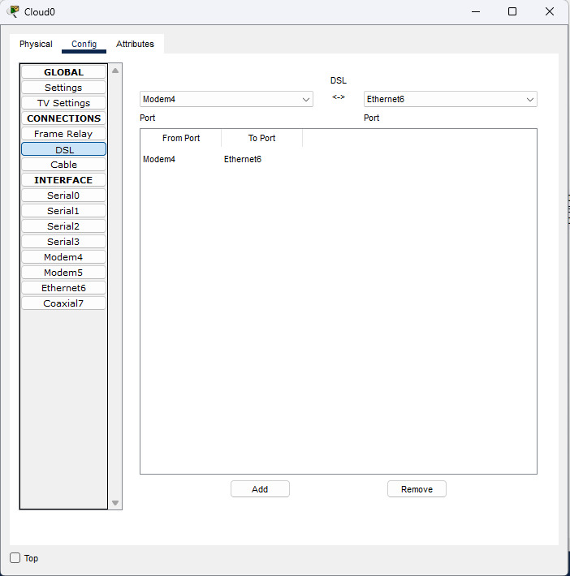
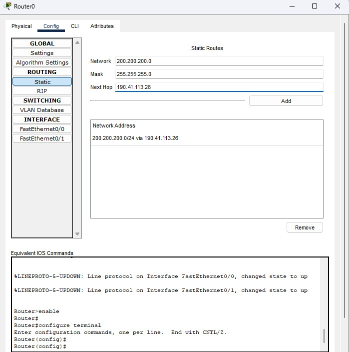
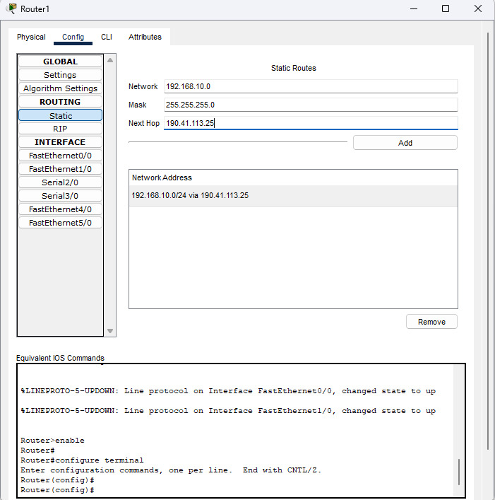
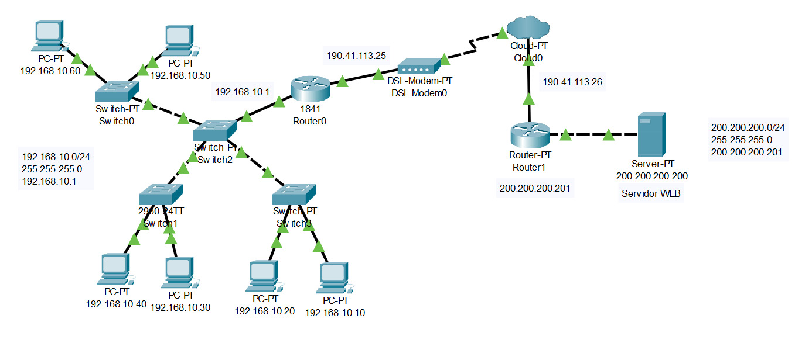
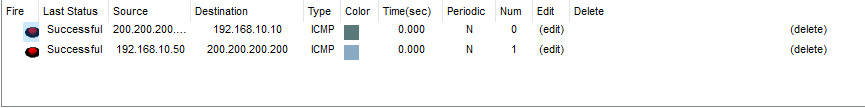

Tenemos el siguiente ejercicio: 
> Ejercicio 3. Configurar un router para que los equipos tenga salida a Internet. Elabore tres redes locales cada una con dos host y segmentalas a través de su ip.

Lo primero será configurar las redes de la izquierda, para ello vamos a usar el rango de IP `192.168.10.0`, la mascara de red `255.255.255.0` y el Dafault Gateway `192.168.10.1`. Es decir, como tenemos seis nodos podriamos asignarles las siguientes IP's: 

- PC0: `192.168.10.10`
- PC1: `192.168.10.11`
- PC2: `192.168.10.12`
- PC3: `192.168.10.13`
- PC4: `192.168.10.14`
- PC5: `192.168.10.15`

Y el Default Gateway para todos será `192.168.10.1`. (Este lo podemos configurar en la pestaña `Desktop` > `IP Configuration` > `Default Gateway`).

## PRECAUCIÓN: 
## Cuando configuremos la IP debemos asegurarnos que la mascara de red (Mask) sea: 
> 255.255.255.0
## De lo contrario podremos tener errores más adelante

Ahora necesitamos configurar el router de la izquierda (el `1841`), para ello vamos a la pestaña `Config` y configuramos las interfaces `FastEthernet0/0` y `FastEthernet0/1` con las siguientes IP's: 

- `FastEthernet0/0`: `192.168.10.1`
- `FastEthernet0/1`: `190.41.113.25`

Listo, tenemos una parte de la red configurada. Ahora vamos a configurar la red de la derecha, para ello vamos a usar el rango de IP `200.200.200.0` y la mascara de red `255.255.255.0`. Es decir, como tenemos un solo nodo (que es un servidor) podriamos asignarle la siguiente IP: 

- Server: `200.200.200.200`

Y el Default Gateway para el servidor será `200.200.200.201`. (Este lo podemos configurar en la pestaña `Desktop` > `IP Configuration` > `Default Gateway`).

Ahora necesitamos configurar el router de la derecha (el `Router-PT`), para ello vamos a la pestaña `Config` y configuramos las interfaces `FastEthernet0/0` y `FastEthernet0/1` con las siguientes IP's: 

- `FastEthernet0/0`: `200.200.200.201`
- `FastEthernet0/1`: `190.41.113.26`

Listo, ahora solo nos queda configurar la nube, para ello vamos a la pestaña `Config` y en la pestaña `DSL` hacemos la conversion del cable `Modem4` a `Ethernet6`. (Simplemente le damos al boton `Add`, en la parte de abajo)

 

Estamos muy cerca de terminar nuestra red. Ahora necesitamos que el router de la izquierda tenga salida a la red de la derecha, y viceversa. Para ello necesitamos que cuando al router le llegue una peticion hacia una IP que no pertenezca a su red, la redireccione hacia la nube y esta se encargue de redirigirlo hacia la red correcta. Esto lo logramos configurando las rutas estaticas en los routers. 

Para el router de la izquierda vamos a la pestaña `Config` y en la pestaña `Static` configuramos la siguiente ruta y le damos `Add`: 

- Network: `200.200.200.0`
- Mask: `255.255.255.0`
- Next Hop: `190.41.113.26`

Y ahora para el router de la derecha vamos a la pestaña `Config` y en la pestaña `Static` configuramos la siguiente ruta y le damos `Add`: 

- Network: `192.168.10.0`
- Mask: `255.255.255.0`
- Next Hop: `190.41.113.25`

Excelente, si seguimos todos los pasos correctamente, deberiamos tener una red que se vea de la siguiente forma: 

Y si hacemos las pruebas correspondientes, es decir, si enviamos un paquete desde el `PCX` (donde `X` es cualquiera de nuestros computadores) hacia el `Server`, deberiamos tener una respuesta `Successful` y lo mismo si enviamos un paquete desde el `Server` hacia el `PCX`. 

