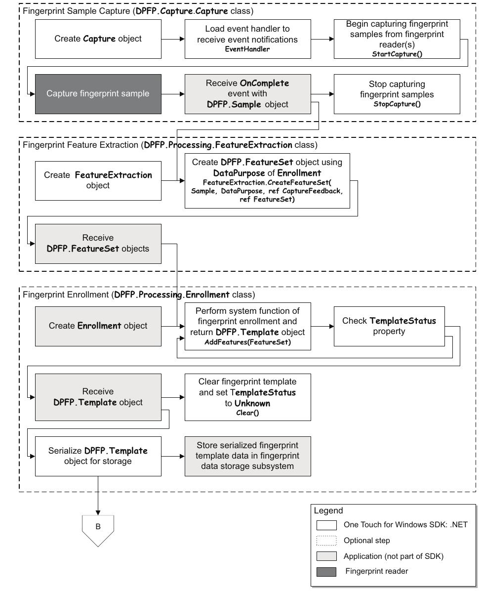
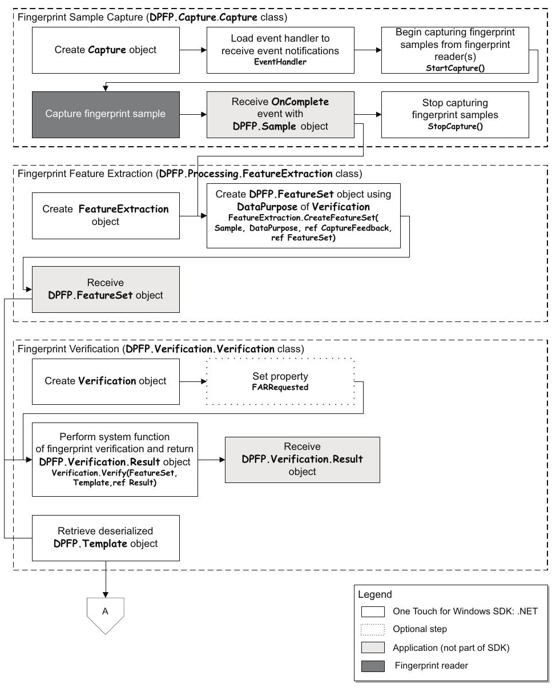
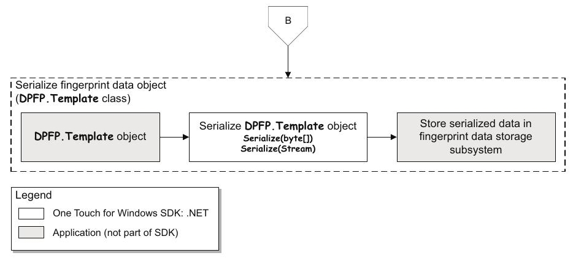
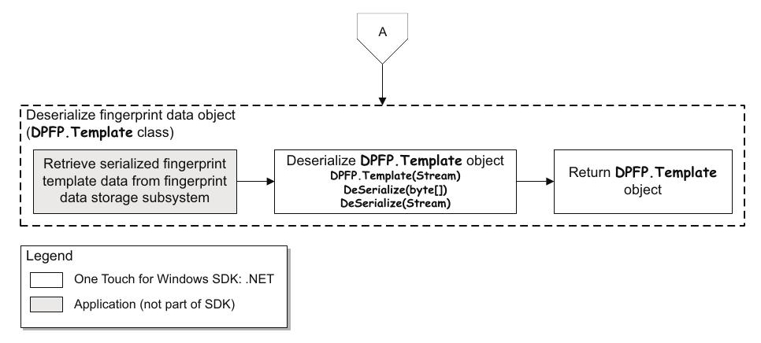

## Introducción

En este artículo se muestra de manera muy sencilla cómo integrar un lector de huella digital (U.are.U 4500) con una base de datos en Access. Para ello, se hace uso de las librerias que proporciona el RTE de DigitalPersona. Para más información, se puede consultar la [documentación oficial](https://github.com/Rooyca/Digital-Persona-SDK/blob/master/Docs/One%20Touch%20for%20Windows%20SDK%20.NET%20Developer%20Guide.pdf).

## Requisitos

- [Descargar SDK](https://github.com/Rooyca/Digital-Persona-SDK/)

## Fingerprint Enrollment Workflow



## Fingerprint Verification Workflow



## Fingerprint Data Object Serialization/Deserialization

### Serialización



### Deserialización



## Evento `Capture_OnComplete` en el enrolamiento

```vba
Private Sub Capture_OnComplete(ByVal ReaderSerNum As String, ByVal Sample As Object)
Dim Feedback As DPFPCaptureFeedbackEnum
Dim blob() As Byte

 Feedback = CreateFtrs.CreateFeatureSet(Sample, DataPurposeEnrollment)
    If Feedback = CaptureFeedbackGood Then
     CreateTempl.AddFeatures CreateFtrs.FeatureSet
     samples.Caption = CreateTempl.FeaturesNeeded
       If CreateTempl.TemplateStatus = TemplateStatusTemplateReady Then
        Set Templ = CreateTempl.Template
        Capture.StopCapture
         
        blob = Templ.Serialize
        
        huella.Value = blob

        MsgBox "The fingerprint template was created."
       End If
    End If

Exithere:
    Exit Sub
ErrHere:
    MsgBox Err.Description
    Resume Exithere
End Sub
```

## Evento `Capture_OnComplete` en la verificación

```vba
Private Sub Capture_OnComplete(ByVal ReaderSerNum As String, ByVal Sample As Object)
 Dim Feadback As DPFPCaptureFeedbackEnum
 Dim Res As DPFPVerificationResult
 Dim Templ As DPFPTemplate

 ReportStatus ("The fingerprint was captured.")
 Feedback = CreateFtrs.CreateFeatureSet(Sample, DataPurposeVerification)

 If Feadback = CaptureFeedbackGood Then
  Capture.StopCapture
  Prompt.Caption = "Touch the fingerprint reader with a different finger."
  If Templ Is Nothing Then
    Dim db As DAO.Database
    Dim rs As DAO.Recordset
    Dim sqlQuery As String

    Set db = CurrentDb

    sqlQuery = "SELECT * FROM Empleados"

    Set rs = db.OpenRecordset(sqlQuery)

    Do While Not rs.EOF
        Dim byteData() As Byte
        byteData = rs!huella
        Set Templ = New DPFPTemplate
        Templ.Deserialize byteData
        
        Set Res = Verify.Verify(CreateFtrs.FeatureSet, Templ)
        
        far.Caption = Res.FARAchieved
        If Res.Verified = True Then
            MsgBox "Nombre: " & rs!nombre_completo
            ReportStatus ("The fingerprint was verified.")
            Exit Do
        Else
            ReportStatus ("The fingerprint was not verified.")
        End If
        rs.MoveNext
    Loop

    rs.Close

    Set rs = Nothing
    Set db = Nothing
  Else
    MsgBox "Nothing here"
  End If
 End If
 End Sub
 ```

## ¿Y ahora qué?

Con lo anterior, tienes los fundamentos que te permitirán integrar un lector de huellas con Access, por supuesto aún queda mucho trabajo para tener una aplicación completa y funcional, pero con esto ya tienes una base sólida para comenzar. Si deseas la base de datos completa puedes escribirme al correo que aparece en la seccion de [Contacto](/es/contacto) o a cualquiera de las redes que aparecen en en el [inicio](/es/). 




