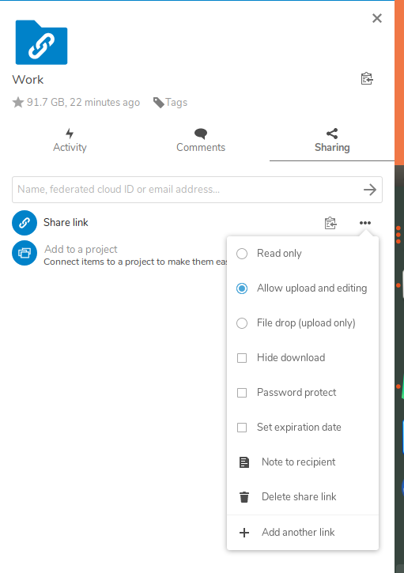

> Puedes encontrar todos los archivos necesarios para este tutorial en el siguiente repo: [https://github.com/Rooyca/upload-nextcloud-cli](https://github.com/Rooyca/upload-nextcloud-cli)

> Te recomiendo clonar el repositorio en tu equipo. Para ello ejecuta el siguiente comando en la terminal:

> ```bash
> git clone https://github.com/Rooyca/upload-nextcloud-cli
> ```

## Configuración

1. Crear un link compartido para una carpeta de Nextcloud. Recordar seleccionar la opción "File Drop (upload only)", o "Allow upload and editing" al crear el link compartido.



> [Imagen tomada de https://cylab.be](https://cylab.be/blog/33/how-to-upload-your-files-to-nextcloud-file-drop-using-curl)

2. Copiar el link compartido. El link debe tener el siguiente formato:

```bash
https://nextcloud.example.com/index.php/s/xXxXxXxXx
```

## Ejecución

En el repositorio podemos encontrar tres formas de ejecutar el script, dependiendo del sistema operativo que estemos utilizando o de si tenemos instalado Python en nuestro sistema.

### Windows

Esta es una version minimalista hecha por mi y para correrla correctamente es necesario tener instalado `CURL` en nuestro sistema. (Lo más probable es que ya lo tengas instalado). Puedes comprobarlo ejecutando el siguiente comando en la terminal:

```bash
curl --version
```

Si no lo tienes puedes intalarlo usando [Chocolatey](https://chocolatey.org/install). Para ello abrimos una PowerShell como administrador y ejecutamos el siguiente comando:

```bash
Set-ExecutionPolicy Bypass -Scope Process -Force; [System.Net.ServicePointManager]::SecurityProtocol = [System.Net.ServicePointManager]::SecurityProtocol -bor 3072; iex ((New-Object System.Net.WebClient).DownloadString('https://community.chocolatey.org/install.ps1'))
```

Una vez instalado `Chocolatey` ejecutamos el siguiente comando para instalar `CURL`:

```bash
choco install curl
```

Una vez instalado `CURL` ya podemos ejecutar el script. Para ello abrimos una terminal en la carpeta donde tengamos el script y ejecutamos el siguiente comando:

```bash
upload_file.bat <ruta_archivo> <user> <ip_server>
```

Si tenemos en cuenta la url del ejemplo anterior, el comando sería el siguiente:

```bash
upload_file.bat test.txt xXxXxXxXx nextcloud.example.com
```

Es decir estariamos subiendo el archivo `test.txt` (el cual se encuentra en nuestro directorio actual) al link compartido `https://nextcloud.example.com/index.php/s/xXxXxXxXx`.

### Linux

> Este script NO es mío. El original lo puedes encontrar en este repositorio: [https://github.com/tavinus/cloudsend.sh](https://github.com/tavinus/cloudsend.sh)

Para usarlo solo tenemos que ejecutar el siguiente comando:

```bash
curl -O 'https://raw.githubusercontent.com/tavinus/cloudsend.sh/master/cloudsend.sh' && chmod +x cloudsend.sh
```

Una vez descargado el script, podemos ejecutarlo de la siguiente forma:

```bash
./cloudsend.sh <file> <folderLink>
```

Si tenemos en cuenta la url del ejemplo anterior, el comando sería el siguiente:

```bash
./cloudsend.sh test.txt https://nextcloud.example.com/index.php/s/xXxXxXxXx
```

### Python

> **ADVERTENCIA**: Si tu sistema operativo es Linux te recomiendo usar el script de Linux, ya que este es muchísimo más completo y tiene más opciones. Esta version en Python fue escrita por mí, por lo que puede contener errores o no funcionar correctamente.

Para usarlo solo tenemos que ejecutar el siguiente comando:

```bash
python upload_file.py <folderLink> <file>
```

Si tenemos en cuenta la url del ejemplo anterior, el comando sería el siguiente:

```bash
python upload_file.py https://nextcloud.example.com/index.php/s/xXxXxXxXx test.txt
```
